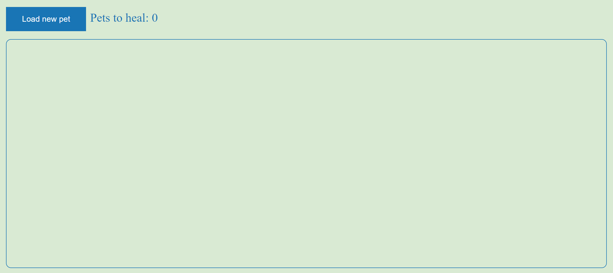
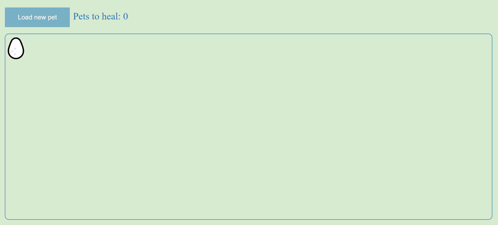
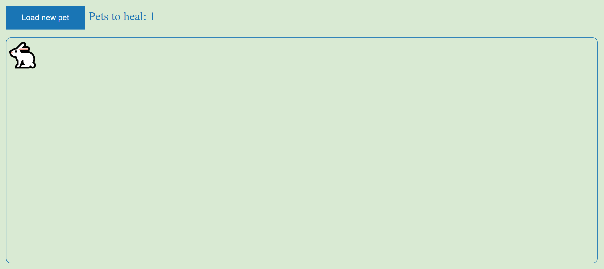
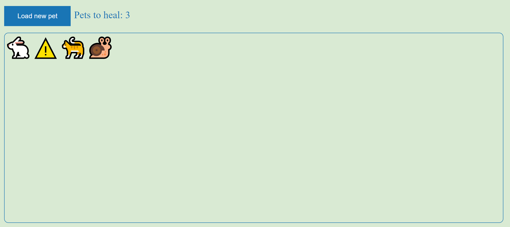

# Redux Thunk Pet Clinic

In this example app, we have a pet clinic, where we can load and heal pets.

In the initial screen we see an empty clinic:


If we click on "Load new pet" and while the pet is loading we will see an egg:


Once the pet is loaded, we will see the pet.
The "Pets to heal" number is then updated:


If an error occured while loading, we will see a warning symbol:


In order to heal a pet, we just click on it

## Motivation

With this example app we want to demonstrate a two use cases to use [redux-thunks](https://redux.js.org/usage/writing-logic-thunks#thunk-use-cases):

- Moving complex logic out of components
- Making async requests or other async logic

## Get started

Install the dependencies:

```shell
$ npm install
```

Run the app

```shell
$ npm run dev
```
